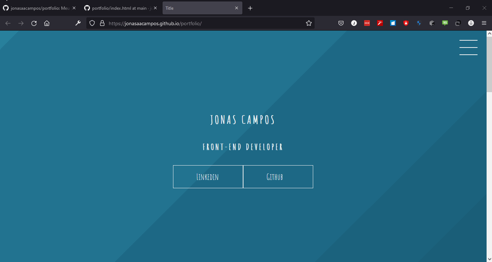
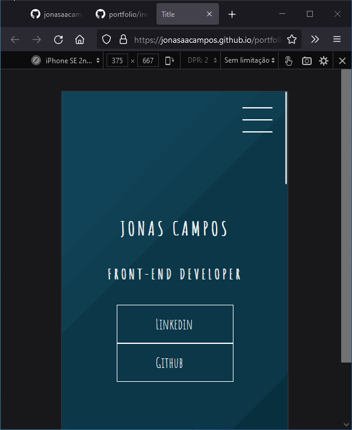

# Portfolio em HTML e animações e CSS

Portifólio para organizar projetos e artigos. Talvez em um futuro integre um blog utilizando angular ou react para criar um gerenciador de conteúdo.

## Demo

**Desktop**

  

**Mobile**

  

------

## Contato

**Author:** Jonas Araujo de Avila Campos

**Confira mais projetos: [AQUI](https://github.com/jonasaacampos)**

  
  

-----------
